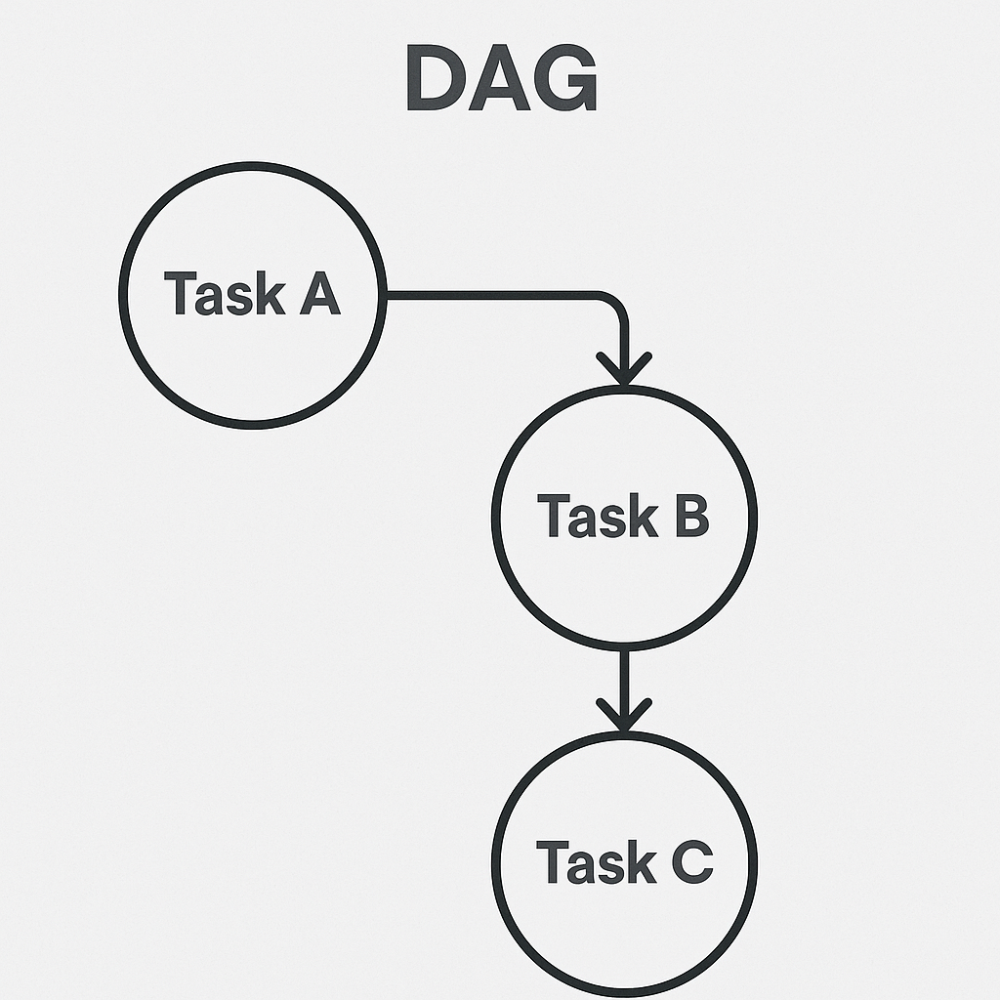

**Оркестрация** — это не просто модный термин, а ключевой компонент в работе дата инженера. В современном мире данных задачи по обработке, 
перемещению, трансформации информации становятся всё сложнее. Данные приходят из разных источников, в разное время, в разных форматах,
с разными требованиями к обработке. Чтобы всё это работало слаженно и без постоянного ручного вмешательства, необходим механизм, который 
будет управлять этими процессами — запускать задачи по расписанию, отслеживать их выполнение, реагировать на ошибки и зависимость между этапами.
Этот механизм и называется **оркестрацией**.

**Оркестрация** — это процесс автоматического управления последовательностью выполнения задач в пайплайне обработки данных. 
Без неё даже простая цепочка ETL превращается в хаотичную и ненадёжную конструкцию, особенно когда нужно учитывать условия: 
не запускать задачу раньше времени, ждать завершения другой задачи, запускать только при наличии новых данных, повторять попытку при сбое и т.д.

Дата инженер без оркестрации — как диспетчер без расписания: он должен постоянно следить вручную, что и когда должно запускаться, 
кто за кем идёт, где произошёл сбой и что теперь делать. Это не просто неэффективно, это не работает в реальных масштабах. 
Чем больше данных, тем выше потребность в чёткой, надёжной и автоматизированной системе управления процессами.

**cron** появился в 1970-х годах в мире Unix. Название происходит от греческого слова "chronos", что значит "время".
И действительно: вся его задача — запускать команды по расписанию. Не следить за зависимостями, не строить графы задач, 
а просто, молча и чётко выполнять заданное.

Система cron работает с так называемым crontab-файлом (от cron table — таблица задач). В этом файле для каждой строки указывается:

    * * * * * команда
    │ │ │ │ │
    │ │ │ │ └──── день недели (0-7) (0 и 7 — это воскресенье)
    │ │ │ └────── месяц (1-12)
    │ │ └──────── день месяца (1-31)
    │ └────────── час (0-23)
    └──────────── минута (0-59)

Например, выглядит вот так мы бы поставили скрипт на исполнение каждый понедельник в 9:00 утра.

    0 9 * * 1  python3 ~/scripts/report.py

У cron есть очень большие ограничения, по типу - 

    Нет понятия зависимостей между задачами
    
    Нельзя отслеживать статус (успешно/ошибка) без дополнительных костылей
    
    Нет перезапусков при сбоях
    
    Нет централизованного мониторинга

**DAG (Directed Acyclic Graph)** — это направленный ациклический граф. В контексте оркестрации задач 
(например, в Apache Airflow, Apache Oozie, Prefect и других системах) DAG используется для описания последовательности выполнения операций.

**Directed (направленный)** — каждая связь между задачами имеет направление: от предыдущей задачи к следующей.

**Acyclic (ациклический)** — в графе нет циклов, то есть задачи не могут зависеть сами от себя или от своих «потомков».

Проще говоря, **DAG** — это способ описать, какие шаги нужно выполнить и в каком порядке, при этом гарантируя, что вы не 
попадёте в бесконечный цикл, если этого целенаправленно не захотите.

**Таска** - это задача, которую необходимо сделать. Значит, в DAG существует несколько задач, которые нужно выполнить. 
У них могут быть определенные условия запуска, определенное время для запуска, определенный код, который необходимо выполнить. 
Разберемся с самым простым - с кодом, которые эти таски могут выполнять. Но, поскольку таски - это все же задача "человеческая", 
а инструмент "по-человечески" не особо то понимает, то было принято решение каждой таске давать собственный оператор, 
который как раз таки и диктует то, что за код будет внутри. И никак иначе.

У каждого типа оператора — своё предназначение: кто-то умеет запускать Python-код, кто-то исполняет shell-команды, 
а кто-то взаимодействует с базами данных или API.

